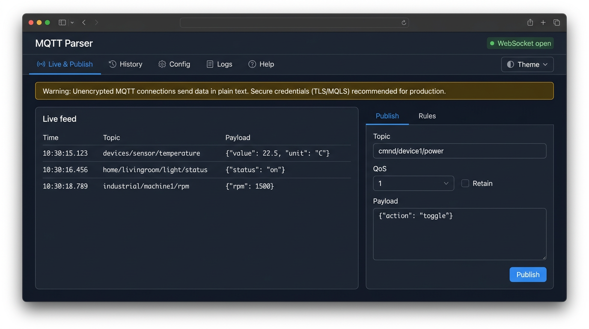

# MQTT Parser

Single **Ubuntu**-based Docker image running **Eclipse Mosquitto** and a **Node.js** web stack: MQTT subscription, **SQLite** persistence, **WebSocket** live feed, **rules** for auto-replies, and manual **publish** from the UI — the **Live** stream shares one tab with a resizable split: **Publish** and **Rules** on the right (sub-tabs). Top-level tabs also include **History**, **Config**, **Logs**, and **Help** (in-app usage guide); work tabs keep short on-screen copy, with fuller operator notes on **Help**.

## Screenshot

Default **Live & Publish** view: live feed (left) and **Publish** / **Rules** sub-tabs (right). You can replace [`docs/screenshots/live-publish.png`](docs/screenshots/live-publish.png) with your own capture if you want an exact match to your build.



See [docs/REQUIREMENTS.md](docs/REQUIREMENTS.md) for the full product specification.

## Quick start

```bash
docker compose up --build
```

- **Web UI:** [http://localhost:8080](http://localhost:8080) (or the host port you map)
- **MQTT:** broker listens on container port **1883** — map it for devices, e.g. `-p 1883:1883`
- **SQLite:** the compose file mounts **`./data`** on the host → you get `data/mqtt-parser.db` (and optional `-wal`/`-shm`) in the project folder after the first run.
- **File ownership:** the web app runs as **`PUID`/`PGID`** (default `1000:1000`) so `data/` is not owned by root on the host. Set them to match your user, e.g. create a `.env` next to `docker-compose.yml`:
  ```bash
  echo "PUID=$(id -u)" >> .env
  echo "PGID=$(id -g)" >> .env
  ```
  Mosquitto still starts as root inside the container; only the Node process drops privileges.

### Plain Docker

```bash
docker build -t mqtt-parser .
mkdir -p data
docker run --rm \
  -e PUID="$(id -u)" -e PGID="$(id -g)" \
  -p 8080:8080 -p 1883:1883 \
  -v "$(pwd)/data:/data" \
  mqtt-parser
```

Devices connect to `tcp://<host-ip>:1883` (or the mapped port). The UI shows a **host hint** field for operators; it does not change networking.

## Data persistence

- **SQLite** path inside the container: `/data/mqtt-parser.db` (see `SQLITE_PATH`).
- Besides **messages**, **rules**, **settings**, and **app logs**, the database stores **`publish_presets`**: up to **30** recent **topic + payload** pairs from **successful** `POST /api/publish` calls (deduplicated by topic and payload, most recently used first). The Publish UI loads them via `GET /api/publish-presets`.
- **`docker compose`** maps **`./data`** from the project root to `/data`, so the database is visible on the host as **`data/mqtt-parser.db`**. The directory is created automatically when the container starts if it does not exist.
- If you previously used the old **named volume** `mqtt-parser-data`, that data still lives under Docker’s volume storage (`docker volume inspect …`); copy the `.db` file out if you need it, or switch back to a named volume in `docker-compose.yml`.
- With plain `docker run`, mount the same way:

```bash
docker run --rm \
  -e PUID="$(id -u)" -e PGID="$(id -g)" \
  -p 8080:8080 -p 1883:1883 \
  -v "$(pwd)/data:/data" \
  mqtt-parser
```

## Environment variables

| Variable | Default | Description |
|----------|---------|-------------|
| `PUID` | `1000` | Unix UID for the **Node** process (SQLite writer); should match host user for `./data` ownership |
| `PGID` | `1000` | Unix GID for the **Node** process |
| `HTTP_PORT` | `8080` | Web server listen port inside the container |
| `MQTT_PORT` | `1883` | Mosquitto listener port (must match app) |
| `MQTT_HOST` | `127.0.0.1` | Default broker host for the **app** MQTT client when the UI field is empty |
| `SQLITE_PATH` | `/data/mqtt-parser.db` | SQLite database file path |
| `MAX_MESSAGE_BYTES` | `262144` | Drop inbound MQTT payloads larger than this (bytes) |

If you change `HTTP_PORT` or `MQTT_PORT`, publish the same ports with `-p` / `compose` accordingly.

**Broker vs app client:** Mosquitto listens on `MQTT_PORT` inside the container. The parser’s MQTT client (configurable in the **Config** UI or via `PATCH /api/config`) must target that same host/port **unless** you intentionally use an external broker. Empty host/port in the UI means “use `MQTT_HOST` / `MQTT_PORT` from the environment.”

## Web UI

Tabs (left to right): **Live & Publish** · **History** · **Config** · **Logs** · **Help**.

| Tab | Notes |
|-----|--------|
| **Live & Publish** | **Vertical split**: live feed (WebSocket, last 500) and a right panel with **Publish** / **Rules** sub-tabs. Draggable divider ratio: `mqttParser.livePublishSplitPct`. Rules: **On** dot toggles enable/disable; edit/delete per row. |
| **History** | Paginated SQLite messages, filters, bulk and filter delete. Columns: fixed checkbox · **ID** · Time · Topic · Payload · fixed delete. Resize grips on **ID**, **Time**, **Topic** only (`mqttParser.historyTableColPcts`). Full-viewport layout. |
| **Config** | Subscription pattern, parse mode, MQTT client to broker, host hint. |
| **Logs** | Application logs from SQLite; periodic refresh and manual refresh. |
| **Help** | In-app usage guide (payload toggle, column resize, publish presets, rules templates, etc.). |

Browser-only preferences (not in SQLite) include theme, live split ratio, live column widths, and history table column widths. Longer explanations for operators live on the **Help** tab.

## Security notes

The default image uses **non-TLS MQTT** and **anonymous** broker access, suitable for lab or trusted LANs only. Do not expose port **1883** to the public internet without TLS, authentication, and firewall rules.

## HTTP API (optional automation)

- `GET /api/health` — liveness and MQTT client state  
- `GET|PATCH /api/config` — subscription pattern, parse mode, host hint, and **MQTT client**: `mqttClientHost`, `mqttClientPort` (number or `""` to clear), `mqttClientUsername`, `mqttClientPassword` (omit to keep; `""` to clear), `mqttProtocol` (`"3.1.1"` \| `"5"`), `mqttKeepalive` (seconds). Changing broker client settings triggers a reconnect. Response includes `mqttClient` (effective host/port, `passwordSet`, etc.).  
- `GET /api/messages` — paginated history (query: `page`, `limit`, `topicContains`, `search`, `fromTs`, `toTs`)  
- `DELETE /api/messages/:id`  
- `POST /api/messages/delete-bulk` — body `{ "ids": [1,2,3] }`  
- `POST /api/messages/delete-by-filter` — body `{ "confirm": true, ...filters }`  
- `GET /api/rules` — list rules  
- `POST /api/rules` — create (camelCase JSON body)  
- `PATCH /api/rules/:id` — update  
- `DELETE /api/rules/:id`  
- `GET /api/publish-presets` — saved publish shortcuts: `{ "items": [ { "id", "topic", "payload", "lastUsedAt" } ] }` (SQLite, newest first, max 30)  
- `POST /api/publish` — body `{ "topic", "payload", "qos", "retain" }`; on **success**, upserts **topic + payload** into **`publish_presets`** (then trims to 30 rows)  
- `GET /ws` — WebSocket stream (`{"event":"message"|"log","data":...}`)

## Development (without Docker)

Requires Node.js 20+.

```bash
# Terminal 1 — broker (or use any MQTT broker on 1883)
mosquitto -p 1883

# Terminal 2 — API + static (serves ../web/dist); for UI dev use Vite separately
cd server && npm install && npm run build
SQLITE_PATH=/tmp/mqtt-parser.db MQTT_PORT=1883 node dist/index.js

# Terminal 3 — web dev server (proxies /api and /ws)
cd web && npm install && npm run dev
```

## Cleaning build and runtime artifacts

Remove generated files so the tree matches a fresh clone (see also `.gitignore`).

**Script (from anywhere):**

```bash
./scripts/clean.sh              # docker compose down + remove node_modules, dist, data
./scripts/clean.sh --rmi        # same, plus docker compose down --rmi local
./scripts/clean.sh --prune      # same as default, then global docker builder/system prune
./scripts/clean.sh --help
```

**Manual (from the repository root):**

```bash
docker compose down
rm -rf web/node_modules web/dist server/node_modules server/dist data
```

- **`web/node_modules`**, **`server/node_modules`** — from local `npm install`.
- **`web/dist`**, **`server/dist`** — from local `npm run build` (the Docker image builds its own copy inside the build context).
- **`data/`** — SQLite files from the compose bind mount (`./data:/data`).

Do **not** delete `package-lock.json` or source files.

**Optional — Docker only:** remove the compose project’s local image after `down`:

```bash
docker compose down --rmi local
```

**Optional — broader host cleanup** (affects unused Docker data globally, not just this project):

```bash
docker builder prune -f
docker system prune -f
```

After cleaning, run again with `docker compose up --build`, or reinstall locally (`npm install` in `web/` and `server/` as needed).

## Project layout

- `config/` — Mosquitto template rendered at start (`MQTT_PORT`)  
- `scripts/entrypoint.sh` — starts Mosquitto, then Node  
- `scripts/clean.sh` — removes local `node_modules`, `dist`, `data`, runs `docker compose down` (optional `--rmi`, `--prune`)  
- `server/` — Fastify API, MQTT client, SQLite, rules engine  
- `web/` — React + Vite UI (`src/tabs/*.tsx` — Live, History, Config, Logs, Help; `App.tsx` shell)  
- `docs/REQUIREMENTS.md` — requirements  
- `docs/screenshots/` — README screenshot(s) (`live-publish.png`)
