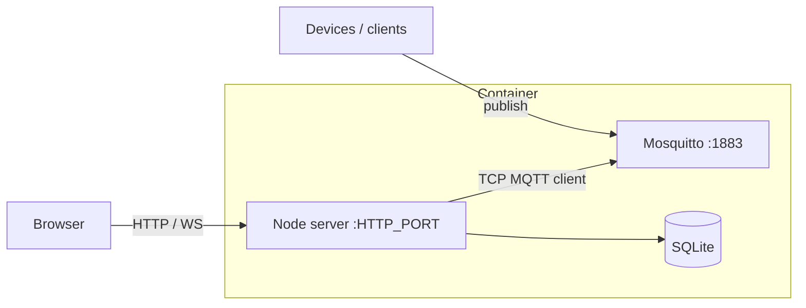
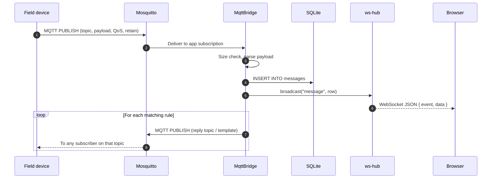
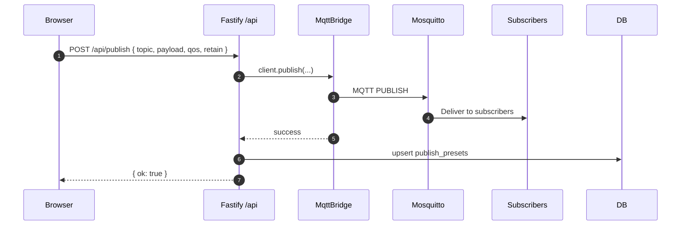
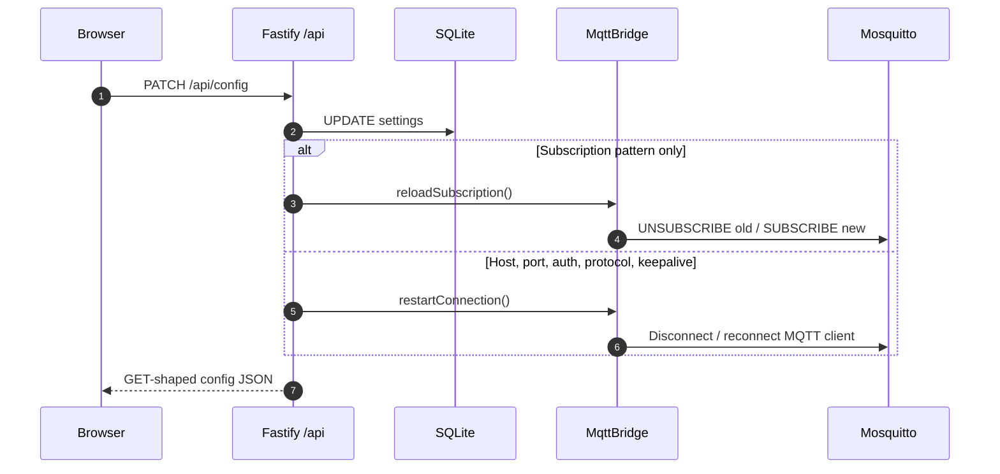
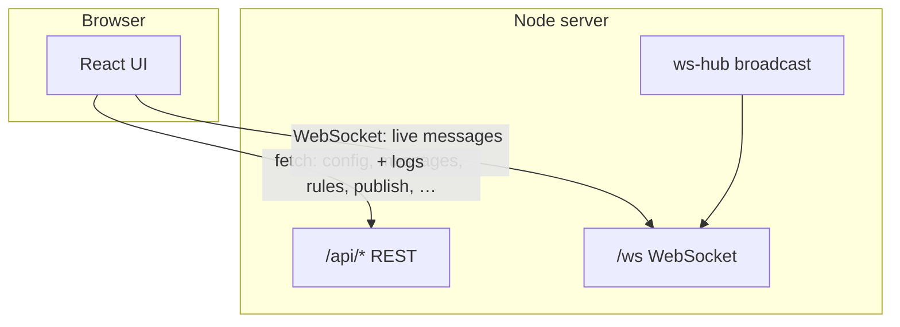
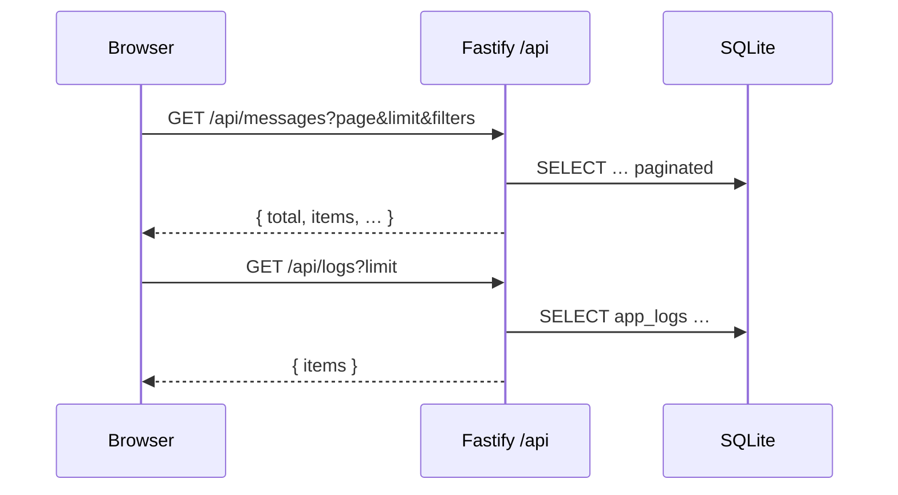

# Architecture

This document describes how **MQTT Parser** is structured at runtime and in code. For product goals and acceptance criteria, see [REQUIREMENTS.md](REQUIREMENTS.md).

## System overview

MQTT Parser is a **single container** that runs:

1. **`mqtt-supervisor.sh`** — background loop (started from the entrypoint) that starts or stops **Eclipse Mosquitto** according to a control file under the SQLite data directory (written by Node from SQLite settings), so the bundled broker can be toggled at runtime without restarting the container.
2. **Eclipse Mosquitto** — optional in-container MQTT broker (when enabled).
3. **Node.js server** — HTTP API, static SPA, WebSocket hub, SQLite access, and an **MQTT client** that subscribes using either an **embedded** or **external** connection profile and applies rules.

The browser loads the **React** UI from the same origin; the UI calls `/api/*` and opens `/ws` for live messages and logs.

## Communication flows

The diagrams below use **MqttBridge** as the logical component implemented in `mqtt-bridge.ts`; **Fastify** covers HTTP, static files, and the `/ws` upgrade in `index.ts`.

### 1. Inbound MQTT: device → operator UI (live)

A field device publishes to the broker. The app’s MQTT client is subscribed (e.g. `#` or a configured pattern). Each message is persisted and pushed over WebSocket; rules may publish replies on the same broker.

### 2. Outbound MQTT: operator UI → broker → devices

Manual publish from the UI hits the REST API; the same MQTT client used for subscriptions performs the publish. Presets are updated only after a successful publish.

### 3. Configuration and broker client lifecycle

Changing MQTT or subscription settings persists to SQLite, then the bridge either resubscribes or reconnects so the next packets use the new parameters.

### 4. Browser: HTTP vs WebSocket

Typical split: **REST** for CRUD, history, config, logs; **WebSocket** for low-latency live feed and log streaming (same JSON envelope as broadcast from the server).

### 5. History and logs (polling / fetch)

History and logs tabs primarily use **HTTP** (`GET /api/messages`, `GET /api/logs`); they do not require WebSocket. Live tab depends on **`/ws`** for real-time rows.

## Container process model

1. **`entrypoint.sh`** (see `scripts/entrypoint.sh`):
   - Ensures the SQLite directory exists and `chown`s it to `PUID`/`PGID` when running as root.
   - Renders `config/mosquitto.conf.template` with `envsubst` → `/etc/mosquitto/mosquitto.conf` (includes `pid_file` for clean stop/start).
   - Starts **`mqtt-supervisor.sh`** in the background (see `scripts/mqtt-supervisor.sh`); the supervisor polls **`${SQLITE_DIR}/.run_embedded_mosquitto`** (`1` = run Mosquitto, `0` = stop).
   - **`exec`**s the Node app as non-root via `setpriv` (`PUID`/`PGID`), so files under `/data` are not owned by root on the host.

2. **Mosquitto** (when the supervisor starts it) listens on `0.0.0.0:${MQTT_PORT}` (default **1883**). The bundled template enables anonymous access (suitable for lab/trusted LANs only).

3. **Node** runs the compiled server (`dist/index.js` after `npm run build`), listens on `HTTP_PORT` (default **8080**), syncs the control file on startup and after config changes, and connects its MQTT client using the **active profile** (`embedded` or `external`) and per-profile host/port in SQLite (with defaults: embedded → `127.0.0.1` + `MQTT_PORT`; external → `MQTT_HOST` + `MQTT_PORT` when fields are empty).

## Backend (`server/`)

| Module | Role |
| -------- | ------ |
| `src/index.ts` | Application composition: Fastify app, registers REST routes, WebSocket, static `public/`, SPA fallback to `index.html`. |
| `src/db.ts` | **better-sqlite3**: schema bootstrap, settings, messages, rules, app logs, publish presets. WAL mode. |
| `src/mosquitto-control.ts` | Writes **`.run_embedded_mosquitto`**; optional **running** check via `/proc` (avoids `kill(0)` EPERM vs root Mosquitto). |
| `src/mqtt-bridge.ts` | **`MqttBridge`**: MQTT client (`mqtt` package), active **embedded** / **external** profile, subscription pattern from settings, inbound pipeline, outbound publish, reconnect on config change. |
| `src/ws-hub.ts` | In-memory `Set` of WebSocket clients; `broadcast(event, data)` JSON-lines to browsers. |
| `src/parser.ts` | Payload display (UTF-8 vs hex), parse modes `auto` / `json` / `text` / `hex`, JSON for `parsed_json` column. |
| `src/topic-match.ts` | MQTT topic filter matching (`+`, `#`). |
| `src/rules-engine.ts` | Rule match (topic + optional regex), template expansion `{{topic}}`, `{{payload}}`, `{{parsed}}`. |

### Inbound message path (device → UI)

1. Broker delivers a publish to the app’s MQTT client.
2. **`MqttBridge`** serializes handling with an internal promise chain (`inboundSerial`) because **better-sqlite3** is synchronous and not re-entrant from overlapping async callbacks.
3. Payload is size-checked (`MAX_MESSAGE_BYTES`), parsed, inserted into **`messages`**, then **`broadcast('message', row)`** pushes to all WebSocket clients.
4. **Rules** are evaluated in order; matching rules trigger **`publish`** on configured reply topics.

### Outbound path (UI / rules → broker)

- **`POST /api/publish`** and rule replies use the same MQTT client **`publish`** path.
- Successful manual publishes update **`publish_presets`** (capped list for the UI).

### Configuration

- Operator settings live in SQLite **`settings`**: subscription pattern, parse mode, host hint, shared MQTT credentials (`mqtt_username`, `mqtt_password`, `mqtt_protocol`, `mqtt_keepalive`), **`embedded_mqtt_broker_enabled`**, **`mqtt_active_profile`**, and per-profile **`mqtt_embedded_*` / `mqtt_external_*`** host and port. Legacy **`mqtt_client_*`** keys are migrated into the profile keys on database open when still in use.
- **`PATCH /api/config`** updates settings, syncs the Mosquitto control file, and may call **`reloadSubscription()`** or **`restartConnection()`** on `MqttBridge`.

## Frontend (`web/`)

- **Vite + React + TypeScript**. Production build output is copied into **`/app/public`** in the Docker image (see Dockerfile `COPY --from=web`).
- **`src/api.ts`** — typed fetch helpers for `/api/*`.
- **`src/hooks/useWebSocket.ts`** — connects to `/ws`, dispatches `message` and `log` events.
- **Tabs** (Live, History, Config, Logs, Help) map to the areas described in [REQUIREMENTS.md](REQUIREMENTS.md).

## Persistence

- **SQLite** single file (`SQLITE_PATH`, default `/data/mqtt-parser.db`). Tables include `messages`, `rules`, `settings`, `app_logs`, `publish_presets`.
- **Broker**: template sets `persistence false` at broker level; long-term message history is **application** responsibility in SQLite.

## Networking and ports

| Port / variable | Purpose |
| ----------------- | -------- |
| `MQTT_PORT` | Mosquitto listener inside the container; map on the host for devices. |
| `HTTP_PORT` | Fastify + static + WebSocket. |
| `MQTT_HOST` | Default broker host for the **external** profile when its host field is empty; also the Node constructor fallback for non-embedded resolution. |
| `MOSQUITTO_PID_FILE` | Optional override (default `/tmp/mosquitto-mqtt-parser.pid`) for health/running checks; must match Mosquitto `pid_file` in generated config. |
| `MOSQUITTO_SUPERVISOR_INTERVAL` | Optional seconds between supervisor polls (default `2`). |

## Build and delivery

- **Dockerfile** multi-stage: build **web** → install/build **server** (native compile for **better-sqlite3** on Ubuntu) → runtime image with Node + Mosquitto.
- **Healthcheck**: `GET /api/health` on loopback.

## Extension points

- **Parsing**: extend `parser.ts` and wire new modes through settings / Config UI.
- **Rules**: stored in SQLite; evaluation is sequential in `mqtt-bridge.ts`.
- **API**: add Fastify routes in `index.ts` (or split into route modules if the file grows).

## Related documentation

- [REQUIREMENTS.md](REQUIREMENTS.md) — product requirements and acceptance criteria.
- [API.md](API.md) — HTTP and WebSocket API reference.
- [DEPENDENCIES.md](DEPENDENCIES.md) — libraries and versions by layer.
- Root [README.md](../README.md) — operator quick start and env vars.
